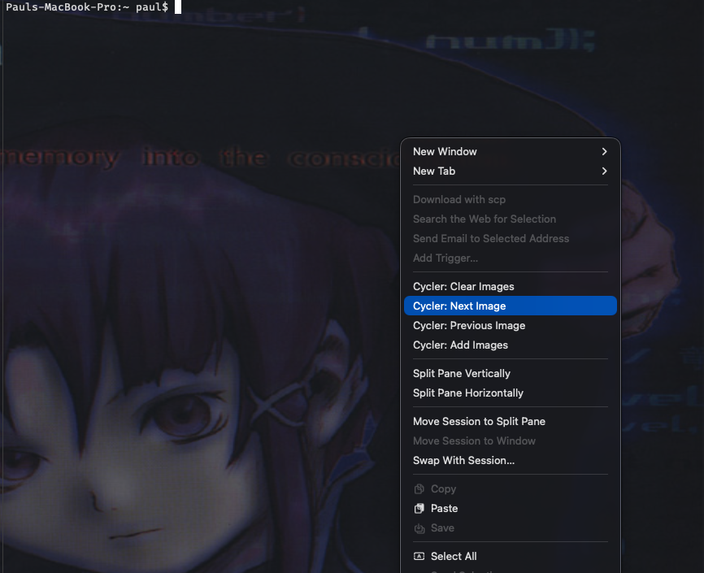

_AI Disclaimer: The first draft of this was created from AI generation. 100% of
the original generation has been reviewed and edited by a human, me :)._

# iTerm2 Background Image Cycler

Automatically cycle through a collection of background images in iTerm2 with full UI controls.

## Features



- **Auto-cycling** - Automatically rotates through your images at a configurable interval
- **Easy image selection** - Native macOS file picker to choose images
- **Manual controls** - Skip forward/backward through images anytime
- **Persistent config** - Your settings and image list survive restarts

## Installation

### Quick Install

1. Run the installation script:

   ```bash
   ./install.sh
   ```

2. Restart iTerm2
3. Done! 🎉

### Manual Install

1. Install the iTerm2 Python API:

   ```bash
   pip3 install iterm2
   ```

2. Copy the script to iTerm2's AutoLaunch folder:

   ```bash
   mkdir -p ~/Library/Application\ Support/iTerm2/Scripts/AutoLaunch
   cp background_cycler.py ~/Library/Application\ Support/iTerm2/Scripts/AutoLaunch/
   chmod +x ~/Library/Application\ Support/iTerm2/Scripts/AutoLaunch/background_cycler.py
   ```

3. Restart iTerm2

## Usage

After installation, access all controls through the context menu by
right clicking on a terminal.

### Initial Setup

1. Right-click a terminal and choose **Cycler: Add Images**
2. Choose one or more image files (hold ⌘ for multiple selection)
3. Images will start cycling automatically!

### Menu Commands

| Command                    | Description                            |
| -------------------------- | -------------------------------------- |
| **Cycler: Add Images**     | Add more images to existing collection |
| **Cycler: Next Image**     | Manually skip to next background       |
| **Cycler: Previous Image** | Go back to previous background         |
| **Cycler: Clear Images**   | Remove all backgrounds                 |

## Configuration Files

The script stores its configuration in:

- `~/Library/Application Support/iTerm2/background_cycler_config.json` - Settings
- `~/Library/Application Support/iTerm2/background_cycler_images.json` - Image list

You can manually edit these files if needed.

## Development

This project uses [silentshell](https://github.com/souldzin/silentshell) for running Claude Code in a containerized environment. The relevant files are:

- `.silentshell.toml` — container name, image config, volume mounts, and env vars
- `config/silentshell.Dockerfile` — the container image definition

## License

MIT License - feel free to modify and share!
